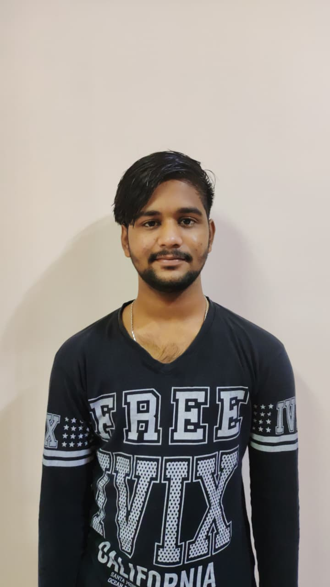

# MY-PROFOLIO-PROJECT1
<!DOCTYPE html>
<html lang="en">
<head>
  <meta charset="UTF-8">
  <meta name="viewport" content="width=device-width, initial-scale=1.0">
  <title>Creative Portfolio</title>
  
</head>
<body>

  <aside>
    
    <section id="about">
    
    </section>
    <h2>D.ACHYUTH KUMAR</h2>
  </aside>

  <main>
    

      <h1>Hello, I'm D.ACHYUTHKUMAR</h1>
      
WEB Developer & Creative Designer

    

    <section id="about">
      <h2>About Me</h2>
      

      Hello! I'm a passionate developer skilled in HTML, CSS,PHP and JavaScript 
    A young frontend developer sits quietly, refining their skills and polishing small projects, while waiting for the right opportunity to showcase their talent. 
     Each day feels like a test of patience, but beneath the calm exterior lies a restless ambition — a determination to prove that their creativity and code can bring ideas to life. 
      They know that when the chance finally arrives, they'll be ready to step forward with confidence and passion. 

    </section>

    <section id="work">
        <h2>Projects</h2>
      <h3>PCS</h3>
      
PCS(PLASTIC COLLECTING SERVICES) 
             Experienced in organizing and managing plastic waste collection initiatives focused on sustainability and environmental impact. 
        Skilled in coordinating logistics for collection, segregation, and safe disposal of plastic materials. 
        Familiar with community outreach programs to raise awareness about recycling practices and reducing plastic pollution. 
        Strong commitment to eco-friendly solutions and contributing to circular economy efforts.
      
    </section>

    <section id="skills">
      <h2>Skills</h2>
      
HTML, CSS, JavaScript,PHP,MYSQL,Responsive Layouts

    </section>
     <section id="resume">
    <h2>Resume</h2>
   <a href="achuuu resume.pdf" download>Download My Resume</a>
  </section>

    <section id="contact">
      <h2>Contact</h2>
      
Email: achyuthdeva440@gmail.com

      
Phone: +91 9000561099

    </section>

    <footer>
      
&copy; 2026 D.ACHYUTH KUMAR. Built with passion.

    </footer>
  </main>

</body>
</html>
